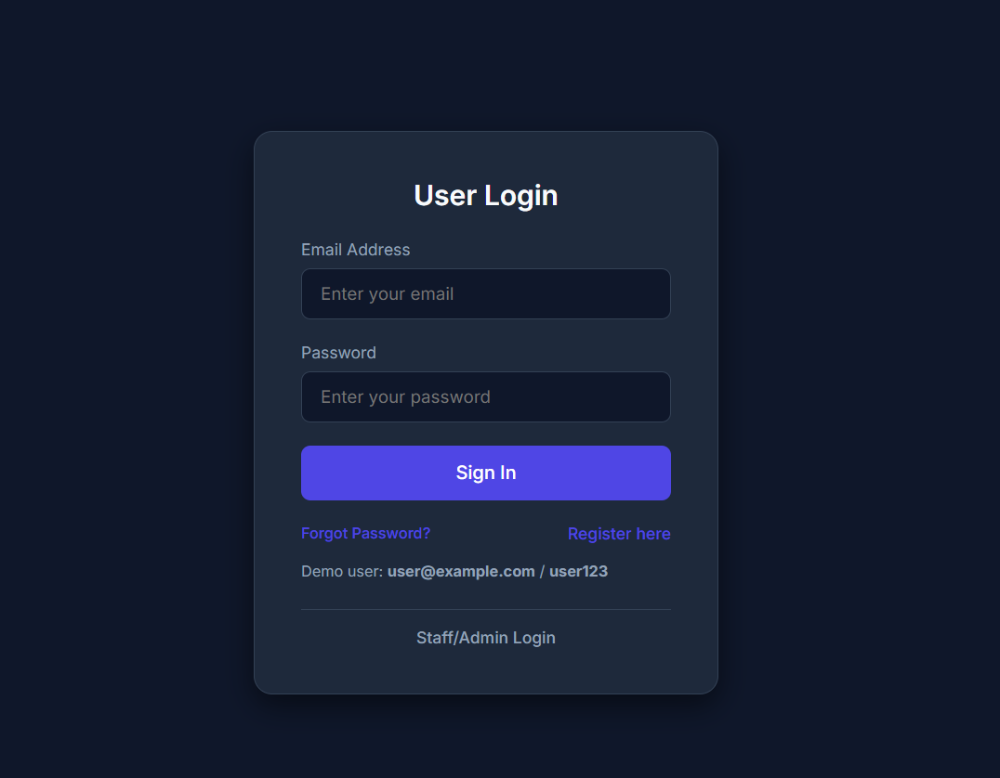
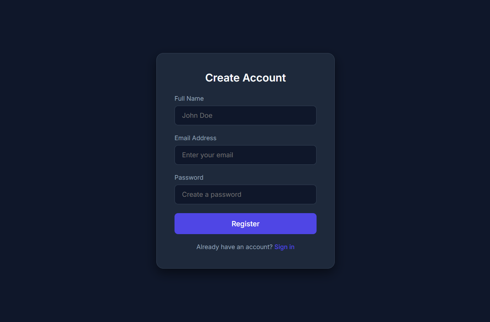
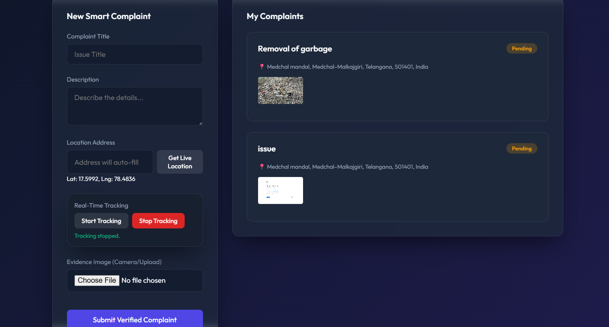
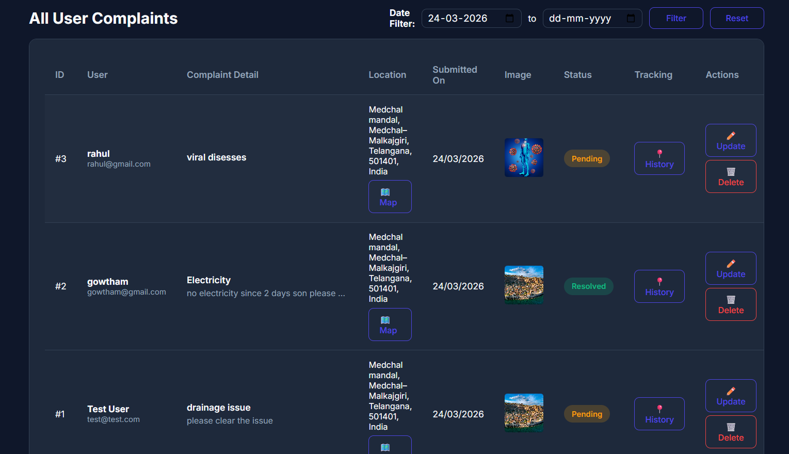
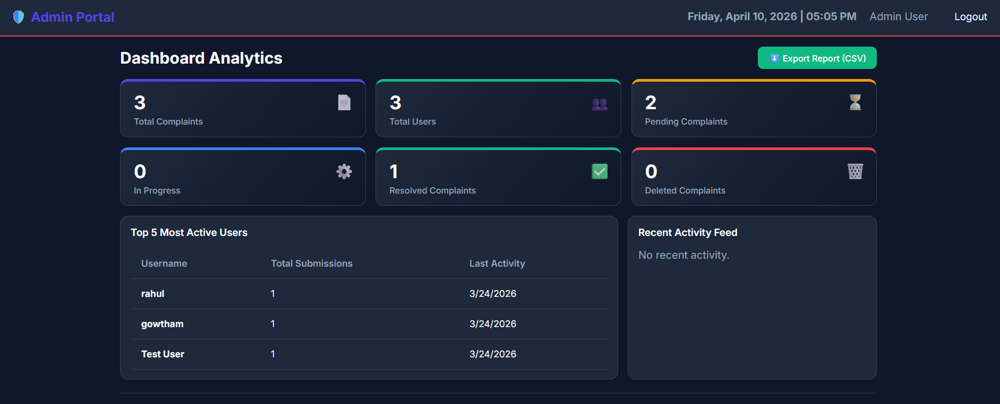

 Digital Complaint Management System (DCMS)

A full-stack web application that enables users to register, submit, and track complaints digitally while providing administrators with a centralized dashboard to manage and resolve complaints efficiently.
------
 # Features:
 
- Secure User Registration & Login
- Complaint Submission with Image Upload
- Complaint Status Tracking
- Address & Location Support 
- Admin Dashboard for Complaint Management
- Update Complaint Status
- Responsive User Interface
- SQLite Database Integration
- RESTful API Communication

 Tech Stack:

# Frontend:
- HTML5
- CSS3
- JavaScript

# Backend:
- Node.js
- Express.js

# Database:
- SQLite
  
# Tools:
- Git
- GitHub
- Visual Studio Code
-------
 Project Structure
-----
digital-complaint-management-system/
│
├── backend/
│   ├── server.js
│   ├── complaints.db
│   ├── uploads/
│   └── package.json
│
├── frontend/
│   ├── index.html
│   ├── login.html
│   ├── register.html
│   ├── complaint.html
│   ├── admin.html
│   ├── admin-dashboard.html
│   ├── forgot-password.html
│   ├── reset-password.html
│   ├── style.css
│   └── script.js
│
├── package.json
└── README.md
--------
#  Installation:
 Clone the Repository
bash
git clone https://github.com/vattikondagowtham-boop/digital-complaint-management-system.git
------
 Install Dependencies
bash
npm install
------
If using the backend separately:
bash
cd backend
npm install

 # Run the Application
# Application Screenshots
# Login Page

# Registration Page

# Complaint Registration

# All Complaints

# Admin Dashboard

Add screenshots of:
- Login Page
- Registration Page
- Complaint Submission
- All users Complaints
- Admin Dashboard
---
# Skills Demonstrated
- Full Stack Web Development
- REST API Development
- CRUD Operations
- Authentication
- Database Management
- Client-Server Architecture
- Responsive Web Design
- Git & GitHub Version Control
------
# Future Enhancements
- JWT Authentication
- Email Notifications
- Role-Based Access Control
- Advanced Search & Filters
- Complaint Analytics Dashboard
- PostgreSQL/MySQL Integration
- Cloud Deployment
---
# Developer
"Vattikonda Gowtham"
B.Tech Student | Aspiring Software Engineer
GitHub: https://github.com/vattikondagowtham-boop
---

# License
This project was developed for educational and learning purposes.
---
